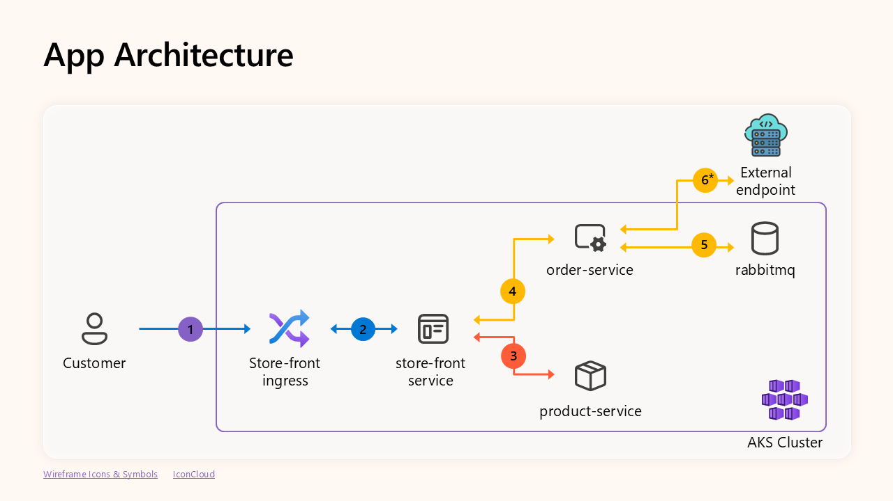
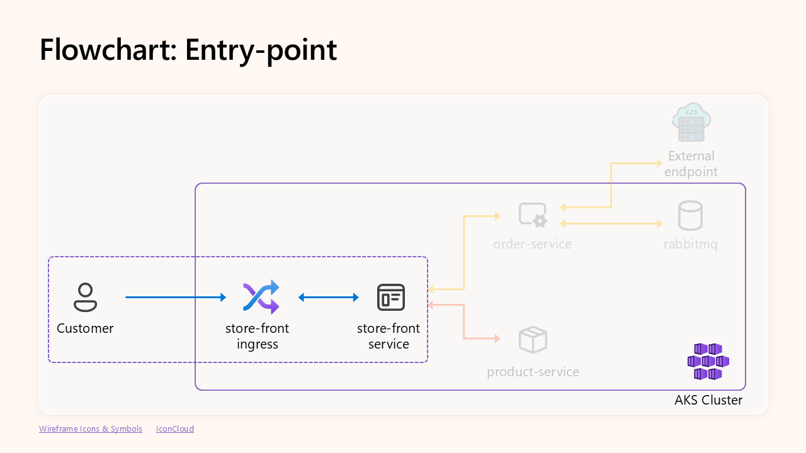
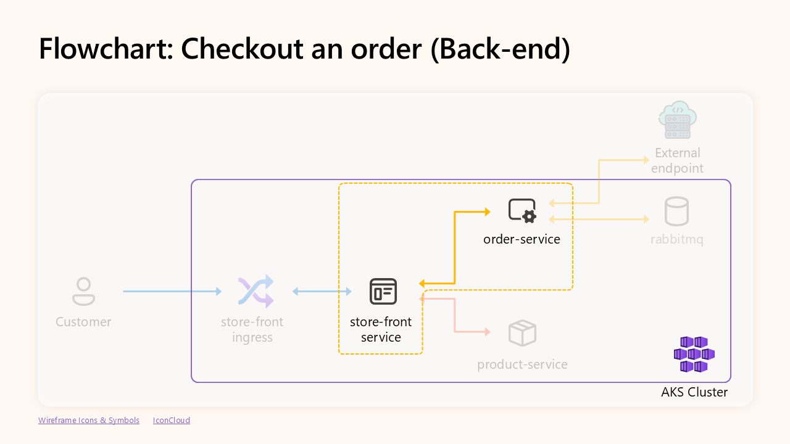
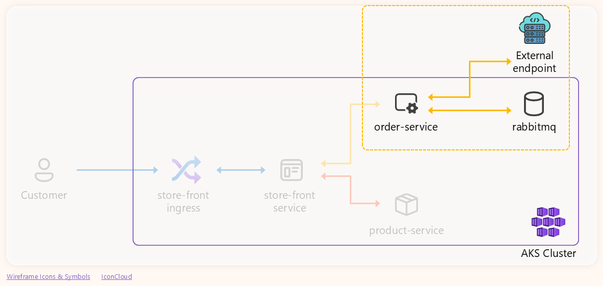
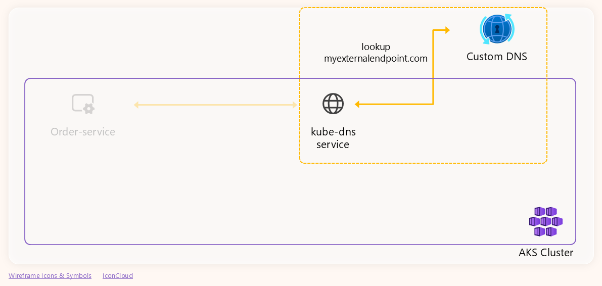

# Demo

## Deploy application

Clean up any previous deployment:

```bash
kubectl delete ns ig-demo
```

Deploy the demo application:

```bash
kubectl create ns ig-demo
kubectl apply -f aks-store-ingress-quickstart.yaml --namespace ig-demo
```

Wait for the app to be ready:

```bash
kubectl wait --for=condition=Ready pods --all --namespace ig-demo --timeout=120s
```

## Demo 1: TCP connection issue

Let's try to use the app by accessing the ingress IP we are using to expose the
app to the Internet:

```bash
PIP=$(kubectl get ingress store-front --namespace ig-demo \
  -o jsonpath='{.status.loadBalancer.ingress[0].ip}')
echo "Public IP to access the app: $PIP"
```

### App architecture

Before we start troubleshooting, let's check the architecture of the demo
application:



### TCP Troubleshooting

Start by checking pods' status:

```bash
kubectl get pod --namespace ig-demo
```

Let's fist focus on the front-end service:



```bash
kubectl logs --namespace ig-demo --selector app=store-front
```

Of course, we can try to identify the IPs' owners...

```bash
kubectl get pods -A -o wide | grep <IP>
```

... but, there is an easier approach: Use [Inspektor Gadget](https://inspektor-gadget.io/).

#### Inspektor Gadget approach

Let's start by [installing the Inspektor Gadget CLI for Kubernetes](https://inspektor-gadget.io/docs/latest/quick-start#kubernetes):

```bash
kubectl krew install gadget
```

Verify the installation:

```bash
kubectl gadget version
```

Then, deploy Inspektor Gadget to the cluster:

```bash
kubectl gadget deploy
```

Verify successful deployment:

```bash
kubectl gadget version
```

Now, let's run the `trace_tcp` to trace the TCP connections of the front-end
service:

```bash
kubectl gadget run trace_tcp \
    --namespace ig-demo --selector app=store-front
```

Given that we are filtering the events by the `store-front` service, we can
avoid printing the Kubernetes metadata:

```bash
kubectl gadget run trace_tcp \
    --namespace ig-demo --selector app=store-front \
    --fields=type,src,dst,error
```

Reproduce the issue again.

The output shows that the issue is not related to the communication between the
`store-front` service and the `product-service` service ...


... but rather to the communication between the `store-front` service and the
`order-service` service.

Now, let's focus on the communication between the `store-front` and the
`order-service` service:



Let's check the logs of the `order-service` service:

```bash
kubectl logs --namespace ig-demo --selector app=order-service
```

The logs show that the `order-service` pod didn't receive any request
from the `store-front` service. So, let's check the `order-service` service
configuration:

```bash
code aks-store-ingress-quickstart.yaml
```

The service's targeting the port (`3001`) doesn't match with the container port (`3000`).


### Fixing issue

Apply the changes:

```bash
kubectl apply -f aks-store-ingress-quickstart.yaml --namespace ig-demo
```

Wait for the app to be ready:

```bash
kubectl wait --for=condition=Ready pods --all --namespace ig-demo --timeout=120s
```

Now the app should be working.

Back to slides.

## Demo 2: DNS issue

### Simulate an issue on the custom DNS server

In the custom DNS server VM, run the following command to simulate the issue:

```bash
update-dns-configuration.sh
```

### Scenario

This is the scenario we are going to troubleshoot:



Now, let's check the logs of the `order-service` service:

```bash
kubectl logs --namespace ig-demo --selector app=order-service
```

Let's use the `trace_dns` gadget. It allows us to trace the DNS queries and
responses across the whole cluster.

```bash
# kubectl gadget run trace_dns:main --all-namespaces
```

### DNS Troubleshooting

Let's focus on the fist phase of DNS resolution:


To analyse that communication, let's use the following flags to analyse:

```bash
kubectl gadget run trace_dns:main \
    --namespace ig-demo --selector app=order-service \
    --filter name==myexternalendpoint.com. \
    --fields src,dst,nameserver,name,id,qr,rcode
```

Only responses with `ServerFailure` response code.

Now, traffic between the `kube-dns` service and the custom DNS server:



```bash
kubectl gadget run trace_dns:main \
    --namespace kube-system --selector k8s-app=kube-dns \
    --filter nameserver.addr==10.224.0.91,name==myexternalendpoint.com. \
    --fields src,dst,nameserver,name,id,qr,rcode
```

`nameserver.addr==<Custom DNS server IP>`: This allows us to see all the
traffic going and coming from the custom DNS server.

The output shows that the `core-dns` pods send several queries to the custom
DNS server, but they never get a response.

Using Inspektor Gadget, we can also verify the general health of the custom DNS
server:

```bash
# kubectl gadget run trace_dns:main \
#    --namespace kube-system --selector k8s-app=kube-dns \
#    --filter nameserver.addr==10.224.0.91 \
#    --fields name,id,qr,qtype,rcode,latency_ns
```

However, given that it's a very common configuration, let's use a gadget
manifest instance instead.

```bash
code ig-demo/upstream-dns-health.yaml
```

And we can run it with the following command:

```bash
kubectl gadget run -f ig-demo/upstream-dns-health.yaml
```

The output will confirm that the custom DNS server is reachable but it's not
replying to the queries related with the `myexternalendpoint.com` domain.


## Extra demo: Reducing the number of DNS queries for external URLs

First of all, ensure custom DNS server configuration is working properly:

```bash
fix-dns-configuration.sh
```

Let's check how the DNS server behaves now:

```bash
# This should work
dig 127.0.0.1 microsoft.com +short

# This should also work
dig 127.0.0.1 myexternalendpoint.com +short
```

Now, run again Inspektor Gadget to check the number of queries for the external
URLs:

```bash
kubectl gadget run trace_dns:main \
    --namespace ig-demo --selector app=order-service \
    --filter 'qr==Q,qtype==A,name~^myexternalendpoint.com.*' \
    --fields src,nameserver,name
```

This time we are using a regular expression to match all the queries that
start with `myexternalendpoint.com`. This will allow us to see all the queries
that are generated by the `order-service` service:

- `myexternalendpoint.com.ig-demo.svc.cluster.local.`
- `myexternalendpoint.com.svc.cluster.local`
- `myexternalendpoint.com.cluster.local.`
- `myexternalendpoint.com.`
- And some others...

### Best practice tips

If you're experimenting this issue, it's recommended to use the fully qualified
domain name (FQDN) for the external URLs. This will help to reduce the number
of DNS queries generated by the application.
In this case, we can use the `myexternalendpoint.com.` domain instead of
`myexternalendpoint.com` in the `order-service` code.

```bash
code src/order-service/routes/root.js
```

```bash
docker build -t ghcr.io/blanquicet/order-service:ig-demo src/order-service
docker push ghcr.io/blanquicet/order-service:ig-demo
```

Now, restart the `order-service` deployment to apply the changes:

```bash
kubectl rollout restart deployment order-service --namespace ig-demo
```

Wait for the app to be ready:

```bash
kubectl wait --for=condition=Ready pods --all --namespace ig-demo --timeout=120s
```

Now, let's run again the `trace_dns` gadget to check the number of queries for
the external URLs:

```bash
kubectl gadget run trace_dns:main \
    --namespace ig-demo --selector app=order-service \
    --filter 'qr==Q,qtype==A,name~^myexternalendpoint.com.*' \
    --fields src,nameserver,name
```

The output should show that the number of queries has been reduced to only
one query for the `myexternalendpoint.com.` domain.
