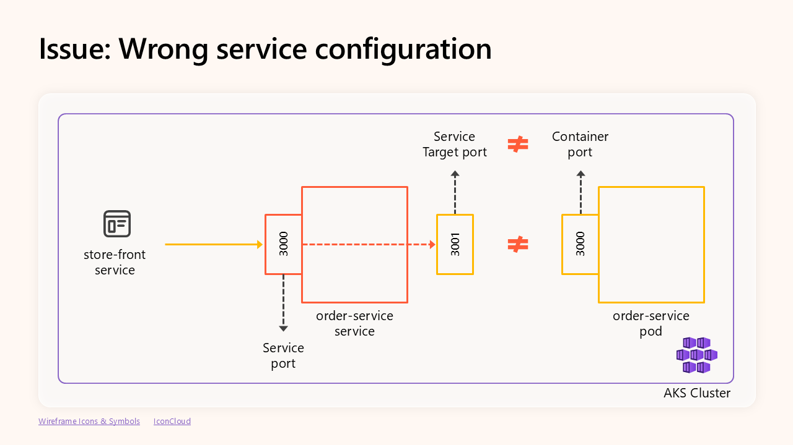

# Detailed guide

This file contains all you need to reproduce the troubleshooting networking
demos presented during the session. Notice it expects to be run on an
environment created following the steps in [setup-env.md](setup-env.md).

## Prerequisites

Clean up namespace:

```bash
kubectl delete ns ig-demo
```

Ensure application performing successful DNS resolutions is running. It will be
useful to isolate the DNS issue during the demo:

```bash
kubectl run anotherapp --image busybox -- /bin/sh -c "while true; do nslookup -querytype=a microsoft.com. && sleep 5; done"
```

Ensure DNS is broken for the demo:

```bash
# 1) SSH to the VM
ssh azureuser@<VM_PUBLIC_IP>

# 2) Run the following command to simulate the issue
break-dns-configuration.sh

# 3) Check the DNS behaviour
# This should work
dig 127.0.0.1 microsoft.com +short
# This should NOT also work
dig 127.0.0.1 myexternalendpoint.com +short

```

## Deploy application

This application is based on example from the [Quickstart: Deploy an Azure
Kubernetes Service (AKS) cluster using Azure
CLI](https://learn.microsoft.com/en-us/azure/aks/learn/quick-kubernetes-deploy-cli). 
Notice the repo containing that application was merged in this one, with several
simplifications.

```bash
kubectl create ns ig-demo
kubectl apply -f aks-store-ingress-quickstart.yaml --namespace ig-demo
```

Wait for the app to be ready:

```bash
kubectl wait --for=condition=Ready pods --all --namespace ig-demo --timeout=120s
```

## Demo 1: TCP connection issue

Let's try to use the app by accessing the ingress IP we are using to expose the
app to the Internet:

```bash
PIP=$(kubectl get ingress store-front --namespace ig-demo \
  -o jsonpath='{.status.loadBalancer.ingress[0].ip}')
echo "Public IP to access the app: $PIP"
```

Open the browser and access the URL:

```bash
http://<INGRESS_IP>
```

### App architecture

Before we start troubleshooting, let's check the architecture of the demo
application:


The application is composed by the following components:

- **store-front**: The front-end service that exposes the UI. Notice is uses a
  `ClusterIP` service type, and uses a [managed NGINX ingress
  controller](https://docs.azure.cn/en-us/aks/app-routing?tabs=default%2Cdeploy-app-default)
  (also called `store-front`) to exposes the front-end service to the Internet.
- **product-service**: The back-end service that handles products.
- **order-service**: The back-end service that handles orders. When an order is
  placed, it "manages" the order by forwarding the request to the `rabbitmq`
  service (which just enqueues the order). Additionally, if the product is
  "*Inspektor Gadget*", the `order-service` service will try to establish a HTTP
  connection to the `myexternalendpoint.com` server. This is a custom server that
  we will use to simulate a DNS issue.

### TCP Troubleshooting

Start by checking pods' status:

```bash
kubectl get pod --namespace ig-demo
```

Let's fist focus on the front-end service:


```bash
kubectl logs --namespace ig-demo --selector app=store-front
```

Of course, we could probably manually associate those IPs with the corresponding
services and pods, but it's tedious and time-consuming:

```bash
kubectl get pods -A -o wide | grep <IP>
```

... but, there is an easier approach: Use [Inspektor Gadget](https://inspektor-gadget.io/).

#### Inspektor Gadget approach

Let's start by [installing the Inspektor Gadget CLI for Kubernetes](https://inspektor-gadget.io/docs/latest/quick-start#kubernetes):

```bash
kubectl krew install gadget
```

Then, deploy Inspektor Gadget to the cluster:

```bash
kubectl gadget deploy
```

Verify successful deployment:

```bash
kubectl gadget version
```

Now, let's run the [trace_tcp
gadget](https://inspektor-gadget.io/docs/latest/gadgets/trace_tcp) to trace the
TCP connections of the front-end service:

```bash
kubectl gadget run trace_tcp \
    --namespace ig-demo --selector app=store-front
```

With flags:

- `--namespace ig-demo`: Namespace where the `store-front` service is running.
- `--selector app=store-front`: Label of the `store-front` service.

Now, given that we are filtering the events by the `store-front` service, we can
avoid printing the Kubernetes metadata, and just show the fields we are
interested in:

```bash
kubectl gadget run trace_tcp \
    --namespace ig-demo --selector app=store-front \
    --fields=type,src,dst,error
```

Now we are also using the `--fields` flag to specify the fields we want to show:

- `type`: Type of TCP connection event. One of: `connect`, `accept`, `close`.
- `src`: Source IP of the TCP event.
- `dst`: Destination IP of the TCP event.
- `error`: Error of the event (if any).

Reproduce the issue by opening the browser and accessing the URL
`http://<INGRESS_IP>` so that we capture all the TCP events.

The output shows that:

- The `store-front` service accepted a connection from the managed NGINX ingress controller.
- The `store-front` service successfully connected to the `product-service`.
- The `store-front` service closed the connection to the `product-service`.
- The `store-front` service failed to connect to the `order-service` service with error `ECONNREFUSED`.

This means that the issue is not related to the communication between the
`store-front` service and the `product-service` service ...


... but rather to the communication between the `store-front` service and the
`order-service`.

Now, let's focus on the communication between the `store-front` and the
`order-service` service:


Let's check the logs of the `order-service` service:

```bash
kubectl logs --namespace ig-demo --selector app=order-service
```

The logs show that the `order-service` pod didn't receive any request
from the `store-front` service. So, let's check the `order-service` service
configuration:

```bash
code aks-store-ingress-quickstart.yaml
```

The service's targeting the port (`3001`) doesn't match with the container port (`3000`).



### Fixing issue

 Let's fix this by changing the `targetPort` of the `order-service` service to `3000`:

```yaml
apiVersion: v1
kind: Service
metadata:
  name: order-service
spec:
  type: ClusterIP
  ports:
  - name: http
    port: 3000
    targetPort: 3000
  selector:
    app: order-service
```

And then, apply the changes:

```bash
kubectl apply -f aks-store-ingress-quickstart.yaml --namespace ig-demo
```

Wait for the app to be ready:

```bash
kubectl wait --for=condition=Ready pods --all --namespace ig-demo --timeout=120s
```

Now the app should be working.

## Demo 2: DNS issue

Demo checking out the *Inspektor Gadget* product in the store.

### Intro to DNS

TODO: Add a diagram with the DNS behaviour in AKS

### Using a custom DNS server

This demo is running in an AKS cluster with a custom DNS server. The custom DNS
server is running in a VM that is part of the same VNet as the AKS cluster. The
custom DNS server is running `dnsmasq` and is configured to resolve the
`myexternalendpoint.com` domain to the IP of a VM that is running a simple HTTP
server.

TODO: Add demo environment diagram

### Scenario

What we are debugging now:


Now, let's check the logs of the `order-service` service:

```bash
kubectl logs --namespace ig-demo --selector app=order-service
```

The logs show that the `order-service` service is trying to resolve the
`myexternalendpoint.com` domain, but it is failing with error: `EAI_AGAIN`.

### DNS Troubleshooting

We are only interested in resolution of the `myexternalendpoint.com`
domain name by the `order-service`.


To analyse that communication, let's use the [trace_dns
gadget](https://inspektor-gadget.io/docs/latest/gadgets/trace_dns). It allows us
to trace the DNS queries and responses across the whole cluster:

```bash
kubectl gadget run trace_dns:main --all-namespaces
```

For this particular case, let's use the following flags to analyse the DNS
traffic between the `order-service` service and the `kube-dns` service:

```bash
kubectl gadget run trace_dns:main \
    --namespace ig-demo --selector app=order-service \
    --filter name==myexternalendpoint.com. \
    --fields src,dst,name,qr,rcode
```

Again, we use the `--namespace` and `--selector` flags to filter the events by
the `order-service` service:

- `--namespace ig-demo`: Namespace where the `order-service` service is
  running.
- `--selector app=order-service`: Label of the `order-service` service.

In addition, we use the `--filter` flag to filter the events we are
interested in:

- `qtype==A`: We are only interested in A records (IPv4 addresses).
- `name==myexternalendpoint.com.`: We are only interested in the
  `myexternalendpoint.com` domain.

Finally, we can use the `--fields` flag to specify the fields we want to show:

- `src`: Source IP of the DNS query/response.
- `dst`: Destination IP of the DNS query/response.
- `nameserver`: IP of the DNS server that was used to resolve the domain.
- `name`: Domain name being queried.
- `id`: DNS query/response ID, used to match queries with responses.
- `qr`: Specifies whether this message is a query (`Q`), or a response (`R`).
- `rcode`: Response code. One of: `Success`, `FormatError`, `ServerFailure`, `NameError`, `NotImplemented`, `Refused`.

In its output, we can see the requests coming from the `order-service` pod to the
`kube-dns` service, but all of them are getting `ServerFailure` as response
code.

Given that it's a external URL, the `kube-dns` will use the upstream DNS
server to resolve the domain name.


Now, traffic between the `kube-dns` service and the custom DNS server:

```bash
kubectl gadget run trace_dns:main \
    --namespace kube-system --selector k8s-app=kube-dns \
    --filter nameserver.addr==10.224.0.91,name==myexternalendpoint.com. \
    --fields src,dst,name,id,qr,rcode
```

This time are filtering the events by the `kube-dns` service:

- `--namespace kube-system`: Namespace where the `kube-dns` service is
  running.
- `--selector k8s-app=kube-dns`: Label of the `kube-dns` service.

Additionally, we are using the `--filter` flag to continue filtering by `qtype`
and `name`, but also by the `nameserver.addr` field:

- `nameserver.addr==<Custom DNS server IP>`: This allows us to see all the
  traffic going and coming from the custom DNS server.

While the fields are the same as before.

The output shows that the `core-dns` pods send several queries to the custom
DNS server, but they never get a response.

Using Inspektor Gadget, we can also verify the general health of the custom DNS
server:

```bash
kubectl gadget run trace_dns:main \
    --namespace kube-system --selector k8s-app=kube-dns \
    --filter nameserver.addr==10.224.0.91 \
    --fields name,id,qr,qtype,rcode,latency_ns
```

However, given that it's a very common configuration, we can create a gadget
manifest instance instead of running the command manually. This will allow us to
reuse it and share it easily.

```bash
code ig-demo/upstream-dns-health.yaml
```

And we can run it with the following command:

```bash
kubectl gadget run -f ig-demo/upstream-dns-health.yaml
```

The output will confirm that the custom DNS server is reachable but it's not
replying to the queries related with the `myexternalendpoint.com` domain.


## Extra demo: Reducing the number of DNS queries for external URLs

First of all, ensure custom DNS server configuration is working properly:

```bash
# 1) SSH to the VM
ssh azureuser@<VM_qPUBLIC_IP>

# 2) Run the following command to fix the issue
fix-dns-configuration.sh
```

Let's check how the DNS server behaves now:

```bash
# This should work
dig 127.0.0.1 microsoft.com +short

# This should also work
dig 127.0.0.1 myexternalendpoint.com +short
```

Now, run again Inspektor Gadget to check the number of queries for the external
URLs:

```bash
kubectl gadget run trace_dns:main \
    --namespace ig-demo --selector app=order-service \
    --filter 'qr==Q,qtype==A,name~^myexternalendpoint.com.*' \
    --fields src,nameserver,name
```

This time we are using a regular expression to match all the queries that
start with `myexternalendpoint.com`. This will allow us to see all the queries
that are generated by the `order-service` service:

- `myexternalendpoint.com.ig-demo.svc.cluster.local.`
- `myexternalendpoint.com.svc.cluster.local`
- `myexternalendpoint.com.cluster.local.`
- `myexternalendpoint.com.`
- And some others...

### Best practice tips

If you're experimenting this issue, it's recommended to use the fully qualified
domain name (FQDN) for the external URLs. This will help to reduce the number
of DNS queries generated by the application.
In this case, we can use the `myexternalendpoint.com.` domain instead of
`myexternalendpoint.com` in the `order-service` code.

```bash
code src/order-service/routes/root.js
```

```bash
docker build -t ghcr.io/blanquicet/order-service:ig-demo src/order-service
docker push ghcr.io/blanquicet/order-service:ig-demo
```

Now, restart the `order-service` deployment to apply the changes:

```bash
kubectl rollout restart deployment order-service --namespace ig-demo
```

Wait for the app to be ready:

```bash
kubectl wait --for=condition=Ready pods --all --namespace ig-demo --timeout=120s
```

Now, let's run again the `trace_dns` gadget to check the number of queries for
the external URLs:

```bash
kubectl gadget run trace_dns:main \
    --namespace ig-demo --selector app=order-service \
    --filter 'qr==Q,qtype==A,name~^myexternalendpoint.com.*' \
    --fields src,nameserver,name
```

The output should show that the number of queries has been reduced to only
one query for the `myexternalendpoint.com.` domain.
