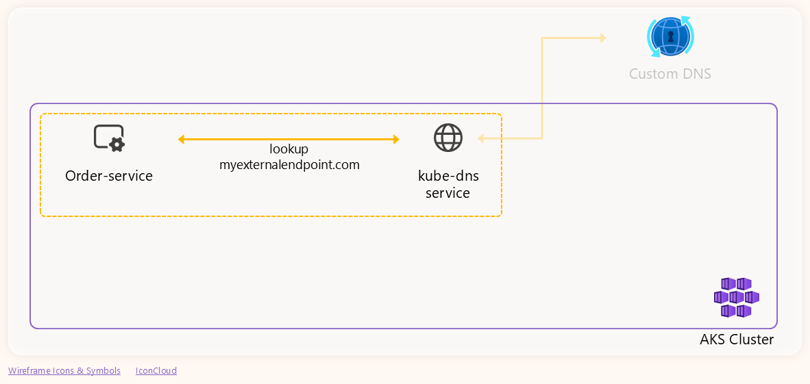
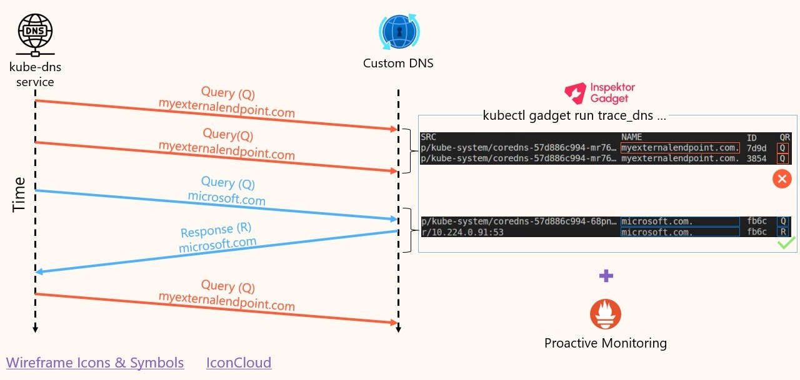

# Notes for the demo

This file contains a subset of the content in the
[detailed-guide](detailed-guide.md) file. It is meant to be used only as a
reference for the speaker during the live demo.

## Prerequisites

```bash
export PS1='cli $ '
```

Verify the kubectl context is set to the AKS cluster:

```bash
kubectl config current-context
```

Clean up namespace:

```bash
kubectl delete ns ig-demo
```

Ensure DNS is broken for the demo:

```bash
# Get node resource group
PROVIDER_ID=$(kubectl get nodes -o jsonpath='{.items[0].spec.providerID}')
NODE_RESOURCE_GROUP=$(echo $PROVIDER_ID | sed -n 's|.*/resourceGroups/\([^/]*\)/providers/.*|\1|p')

USERNAME="azureuser"
PUBLIC_IP_NAME="tmp-pip"

# Get the public IP address of the VM
PIP=$(az network public-ip show \
  --resource-group $NODE_RESOURCE_GROUP \
  --name          $PUBLIC_IP_NAME \
  --query         ipAddress -o tsv)
echo "ssh $USERNAME@$PIP"

# SSH to the VM
ssh -o StrictHostKeyChecking=no $USERNAME@$PIP

# 2) Run the following command to simulate the issue
export PS1='dns-vm $ '
break-dns-configuration.sh

# 3) Check the DNS behaviour
# This should work
dig 127.0.0.1 microsoft.com +short
# This should NOT also work
dig 127.0.0.1 myexternalendpoint.com +short
```

Prepare applications (FIXME: Update tags here and in the `aks-store-ingress-quickstart.yaml` file):

```bash
docker build -t ghcr.io/blanquicet/order-service:ig-demo src/order-service
docker push ghcr.io/blanquicet/order-service:ig-demo

docker build -t ghcr.io/blanquicet/product-service:ig-demo src/product-service
docker push ghcr.io/blanquicet/product-service:ig-demo

docker build -t ghcr.io/blanquicet/store-front:ig-demo src/store-front
docker push ghcr.io/blanquicet/store-front:ig-demo
```

## Deploy application

Deploy the demo application:

```bash
kubectl create ns ig-demo
kubectl apply -f aks-store-ingress-quickstart.yaml --namespace ig-demo
```

Ensure application performing successful DNS resolutions is running. It will be
useful to isolate the DNS issue during the demo:

```bash
kubectl run anotherapp --namespace ig-demo --image busybox -- /bin/sh -c "while true; do nslookup -querytype=a microsoft.com. && sleep 5; done"
```

Wait for the app to be ready:

```bash
kubectl wait --for=condition=Ready pods --all --namespace ig-demo --timeout=120s
kubectl get pods -n ig-demo
```

## Demo 1: TCP connection issue

Let's try to use the app by accessing the ingress IP we are using to expose the
app to the Internet:

```bash
PIP=$(kubectl get ingress store-front --namespace ig-demo \
  -o jsonpath='{.status.loadBalancer.ingress[0].ip}') && \
  echo "Public IP to access the app: $PIP"
```

### App architecture

Before we start troubleshooting:


### TCP Troubleshooting

Let's fist focus on the front-end service:


So, let's check the logs of the `store-front` service:

```bash
kubectl logs --namespace ig-demo --selector app=store-front
```

Analyse logs: **tedious and time-consuming**.

Easier approach: Use *Inspektor Gadget*.

#### Inspektor Gadget approach

Let's start by installing the Inspektor Gadget:

CLI:

```bash
kubectl krew install gadget
```

Deploy Inspektor Gadget to the cluster:

```bash
kubectl gadget deploy
```

Now, let's run the `trace_tcp` to trace the TCP connections of the front-end
service:

```bash
kubectl gadget run trace_tcp \
    --namespace ig-demo --selector app=store-front \
    --fields=type,src,dst,error
```

Reproduce the issue again.

What we got from that output:

ISSUE: Communication between the `store-front` service and the `order-service` service

New focus: communication between the `store-front` and the `order-service` service:


Let's check the logs of the `order-service` service:

```bash
kubectl logs --namespace ig-demo --selector app=order-service
```

Service is not actually the one handling the request, but the pod:


Let's check the `order-service` service configuration:

```bash
code aks-store-ingress-quickstart.yaml
```

Recap of the issue:


### Fixing issue

```bash
code aks-store-ingress-quickstart.yaml
kubectl apply -f aks-store-ingress-quickstart.yaml --namespace ig-demo
```

Wait for the app to be ready:

```bash
kubectl wait --for=condition=Ready pods --all --namespace ig-demo --timeout=120s
```

App working again.

Back to slides.

## Demo 2: DNS issue

Demo checking out the *Inspektor Gadget* product in the store.

### Scenario

What we are debugging now:


Now, let's check the logs of the `order-service` service:

```bash
kubectl logs --namespace ig-demo --selector app=order-service
```

### DNS Troubleshooting

We are only interested in resolution of the `myexternalendpoint.com`
domain name by the `order-service`.



To analyse that communication, let's use the following flags:

```bash
kubectl gadget run trace_dns:main \
    --namespace ig-demo --selector app=order-service \
    --filter name==myexternalendpoint.com. \
    --fields src,dst,name,qr,rcode
```

Only responses with `ServerFailure` response code.

Given that it's a external URL, the `kube-dns` will use the upstream DNS
server to resolve the domain name.


Now, traffic between the `kube-dns` service and the custom DNS server:

```bash
kubectl gadget run trace_dns:main \
    --namespace kube-system --selector k8s-app=kube-dns \
    --filter nameserver.addr==10.224.0.92,name==myexternalendpoint.com. \
    --fields src,dst,name,id,qr,rcode
```

The output shows that the `core-dns` pods send several queries to the custom
DNS server, but they never get a response.

Using Inspektor Gadget, we can also verify the general health of the custom DNS
server:

```bash
kubectl gadget run trace_dns:main \
    --namespace kube-system --selector k8s-app=kube-dns \
    --filter nameserver.addr==10.224.0.92 \
    --fields name,id,qr,qtype,rcode,latency_ns
```

The output will confirm that the custom DNS server is reachable but it's not
replying to the queries related with the `myexternalendpoint.com` domain.



## Extra demo: Reducing the number of DNS queries for external URLs

First of all, ensure custom DNS server configuration is working properly:

```bash
fix-dns-configuration.sh
```

Let's check how the DNS server behaves now:

```bash
# This should work
dig 127.0.0.1 microsoft.com +short

# This should also work
dig 127.0.0.1 myexternalendpoint.com +short
```

Now, run again Inspektor Gadget to check the number of queries for the external
URLs:

```bash
kubectl gadget run trace_dns:main \
    --namespace ig-demo --selector app=order-service \
    --filter 'qr==Q,qtype==A,name~^myexternalendpoint.com.*' \
    --fields src,nameserver,name
```

This time we are using a regular expression to match all the queries that
start with `myexternalendpoint.com`. This will allow us to see all the queries
that are generated by the `order-service` service:

- `myexternalendpoint.com.ig-demo.svc.cluster.local.`
- `myexternalendpoint.com.svc.cluster.local`
- `myexternalendpoint.com.cluster.local.`
- `myexternalendpoint.com.`
- And some others...

### Best practice tips

Use the fully qualified domain name (FQDN) for the external URLs:

```bash
code src/order-service/routes/root.js
```

```bash
docker build -t ghcr.io/blanquicet/order-service:ig-demo src/order-service
docker push ghcr.io/blanquicet/order-service:ig-demo
```

Now, restart the `order-service` deployment to apply the changes:

```bash
kubectl rollout restart deployment order-service --namespace ig-demo
```

Wait for the app to be ready:

```bash
kubectl wait --for=condition=Ready pods --all --namespace ig-demo --timeout=120s
```

Now, let's run again the `trace_dns` gadget to check the number of queries for
the external URLs:

```bash
kubectl gadget run trace_dns:main \
    --namespace ig-demo --selector app=order-service \
    --filter 'qr==Q,qtype==A,name~^myexternalendpoint.com.*' \
    --fields src,nameserver,name
```

The output should show that the number of queries has been reduced to only
one query for the `myexternalendpoint.com.` domain.
